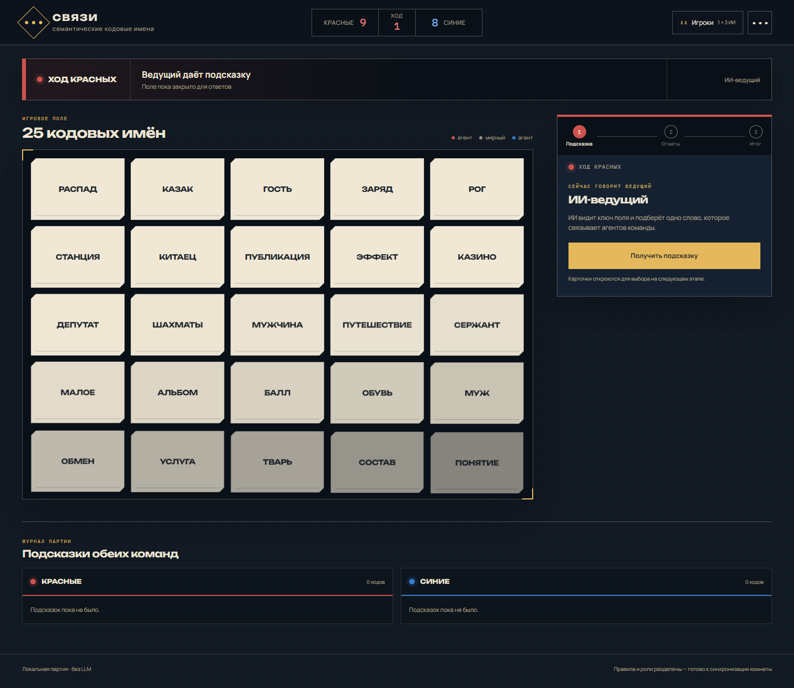
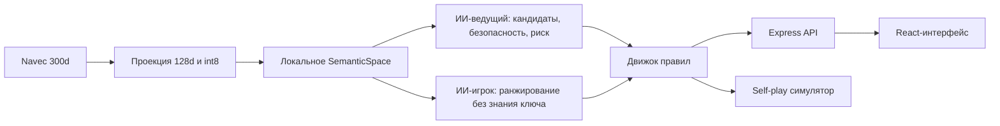

# Связи

Локальная версия Codenames, в которой ведущим и игроком могут быть семантические агенты. Проект **не использует LLM, облачные API и базу контекстно.рф**: вся логика работает на локальных русских эмбеддингах Navec, морфологии и явной функции риска.

В репозитории уже лежит готовая компактная модель: 50 000 слов для подсказок, 2 500 слов для карточек, 128 измерений и 192 заранее рассчитанных соседа на каждое игровое слово. После `npm install` интернет для игры не нужен.



## Что уже работает

- классическое поле 5 × 5, ключ 9/8/7/1 и полные условия победы;
- гибкие составы команд: человек или ИИ на месте ведущего и любое число оперативников;
- явный цикл каждого хода: ведущий даёт подсказку → оперативники отвечают → команда видит итог;
- настройка человека или ИИ отдельно для ведущего и оперативников обеих команд;
- командное голосование: при нескольких оперативниках карточка открывается только после единогласного выбора;
- подсказки на несколько слов с проверкой всех чужих карт и убийцы;
- ходы без искусственного лимита ответов и память незакрытых подсказок со счётчиком `1/2`: остаток уточняется перед новой подсказкой, а ИИ учитывает все активные подсказки при выборе карточки;
- запрет слов с поля, их форм, однокоренных и подозрительно похожих подсказок;
- настраиваемые охват подсказок ИИ-ведущего и риск ИИ-оперативников прямо во время партии;
- свободная подсказка вне словаря Navec, когда в команде оперативников нет ИИ;
- постоянный ключ на экране человека-ведущего на всех этапах хода;
- объяснимая трасса: косинусная близость, ранг карточки, запас до опасного слова и уверенность;
- автоплей, история партии и встроенный прогон до 500 партий;
- CLI-симулятор для больших воспроизводимых экспериментов;
- адаптивный интерфейс для десктопа и телефона.

## Запуск

Нужен Node.js 22+.

```bash
npm install
npm start
```

Откройте [http://localhost:4174](http://localhost:4174). Перед запуском `prestart` сам проверит TypeScript и соберёт production-фронтенд в `dist`; отдельно это делается командой:

```bash
npm run build
```

Для разработки с hot reload:

```bash
npm run dev
```

## Как это устроено



Ведущий видит роли и перебирает ближайшие к своим словам допустимые подсказки. Для каждой подсказки он ранжирует **все** закрытые карточки, находит безопасный префикс до первой чужой карты и оптимизирует число связанных слов, силу связи и запас до опасности. Убийца получает отдельный повышенный штраф.

Игрок получает только слова, подсказку и число — без карты ролей. Он добавляет к косинусной близости небольшую детерминированную ошибку восприятия, сортирует карточки и может остановиться, если связь слабая или варианты почти неразличимы.

Подробные формулы и устройство packed-модели описаны в [docs/ALGORITHM.md](docs/ALGORITHM.md).

## Модель

Готовые файлы находятся в `data/model`:

| Файл | Содержимое |
| --- | --- |
| `meta.json` | версия формата и размеры модели |
| `lexicon.json` | слова и их Snowball-основы |
| `board.json` | 2 500 индексов слов для карточек |
| `vectors.i8` | квантованные векторы 50 000 × 128 |
| `norms.f32` | нормы квантованных векторов |
| `neighbors.u32` | индексы 192 соседей для каждой карточки |
| `neighbor-scores.i16` | точные близости до квантования |

Модель можно воспроизвести или собрать с другими размерами. Нужен Python 3.10+; исходный архив Navec будет загружен в игнорируемый `data/cache`.

```bash
npm run prepare:model
```

Параметры доступны через `python scripts/prepare_model.py --help`. Словарь строится из частотного списка `wordfreq`, лемматизируется `pymorphy3`, отбрасывает имена собственные и оставляет для поля только существительные, присутствующие в Navec.

## Проверка и симуляции

```bash
npm run check
npm run simulate -- --games 1000 --seed 20260722
npm run simulate:full
```

Последняя команда прогоняет 10 000 партий и сохраняет модель, seed и метрики в `data/evaluations/10000-games.json`. Среди метрик: баланс побед, доля окончаний на убийце, средняя длина партии, среднее число в подсказке и распределение подсказок 1–4.

Контрольный прогон готовой модели (`seed=20260722`, сбалансированный профиль обеих команд):

| Метрика | Результат |
| --- | ---: |
| Партии | 10 000 |
| Победы красных / синих | 5 042 / 4 958 |
| Финиши на убийце | 994 (9,94%) |
| Средняя длина | 10,315 хода |
| Среднее число в подсказке | 1,660 |
| Правильных карточек за ход | 1,373 |
| Подсказки на 1 / 2 / 3 / 4 | 61 376 / 21 722 / 13 790 / 6 263 |

Прогон занял 356,9 секунды на одном локальном процессе. Полный машинно-читаемый результат лежит в [data/evaluations/10000-games.json](data/evaluations/10000-games.json).

## HTTP API

- `GET /api/status` — модель и доступные режимы;
- `POST /api/games` — новое детерминированное поле;
- `POST /api/clues` — ход ИИ-ведущего;
- `POST /api/clues/analyze` — проверка и разбор подсказки человека;
- `POST /api/guesses` — план ИИ-игрока;
- `POST /api/turns` — полный ход, в том числе с подсказкой человека;
- `POST /api/turns/resolve` — авторитетное применение выбранных карточек;
- `POST /api/legality` — проверка допустимости подсказки;
- `POST /api/simulations` — 1–500 партий;
- `GET /api/words/:word` — наличие слова;
- `GET /api/associations/:word?limit=20` — ближайшие ассоциации.

Основа мультиплеера доступна через `POST /api/rooms`, `GET /api/rooms/:code`, добавление участников и изменение их команды/роли. Сейчас интерфейс использует локальные назначения ролей; следующим транспортным слоем может стать WebSocket-синхронизация состояния комнаты без изменения игровых действий.

Тела запросов валидируются Zod. Состояние партии передаётся явно, поэтому алгоритмы легко тестировать и переносить в другой транспорт.

## Почему не контекстно.рф

У контекстно.рф действительно не видно LLM в игровом цикле: сервис похож на поиск по заранее рассчитанной близости слов. У публичного фронтенда обнаруживается endpoint ближайших слов, но не найдено стабильной документации API и лицензии на массовое использование базы. Поэтому этот MVP не скрейпит сервис и не зависит от него.

Если владелец даст разрешение или опубликует дамп, достаточно реализовать ещё один адаптер интерфейса `SemanticSpace`; игровой ИИ и UI менять не придётся.

## Ограничения

- близость эмбеддингов не разрешает многозначность слова по текущему контексту;
- корпус Navec литературный, поэтому часть ассоциаций звучит книжно;
- список карточек отфильтрован автоматически, а не вычитан редактором вручную;
- морфологический фильтр намеренно консервативен и иногда запрещает честную подсказку;
- ИИ имитирует интерпретацию слова, но не рассуждает и не понимает правила как LLM.

Проект специально разделяет семантический слой, правила и агентов: можно заменить Navec на RuBERT/fastText/лицензированную базу контекстно и честно сравнить их одним симулятором.

Зависимости и оговорки по данным перечислены в [THIRD_PARTY_NOTICES.md](THIRD_PARTY_NOTICES.md).
